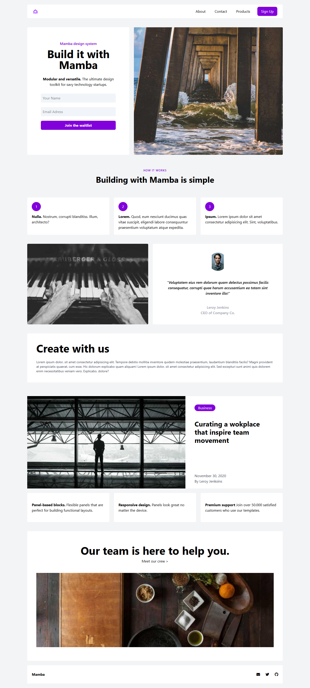

# :shopping_cart: TailwindCSS LandingPage Projesi | Mamba

* Bu proje, Patika Frontend Bootcamp'i için oluşturulan **Hafta-4 / Ödev-1 / TailwindCSS LandingPage** projesidir.
* **CSS:Tailwind** alıştırması için bir pratik projesidir.
* **HTML**,**CSS**,**Tailwind** kullanılmıştır.
*   Patika tarafından verilen LandingPage template tasarımı Tailwind kullanılarak klonlandı.
---

## :computer: Kullanım

1.  Hafta-4 projelerimin olduğu toplu repomu klonlayın.
*   git clone https://github.com/tunahanyasar/Hafta-4.git
2. Odev-1 proje dosyasını seçerek çalıştırın.

---

## 📜 Sayfa Yapısı

:open_file_folder: **Klasörler;**
* *index.html*
* *tailwind.config.js*
* *img*
* *img-page*

1. ***index.html***: Websitesi açıldığında Anasayfa karşılamaktadır. **one-page website** olarak tasarlanmıştır. 
    1.  Anasayfada **header** ve **header**in içinde **nav** bulunur. **nav** ile about, contact, products alanlarına sayfa içinde yönlendirmeler yapılabilir. 
    2.  Ana içerik **Main** den oluşmakta ve içinde 6 adet **Section** bulunmakta;
        1. İlk **Section** hero kısmı. Contact için form bulunuyor.
        2. İkinci **Section** about kısmı.
        3. Üçüncü ve Dördüncü **Section** kısmında yazarın eserleri bulunuyor.
        4. Beşinci **Section** products kısmı.
        6. Altıncı **Section** sayfanın son kısmı.
    3. **Footer**
3.  ***tailwin.config.js:*** index.html için yazılan TailwindCSS özelliklerinin TailwindCSS IntelliSense eklentisinin kullanımı için oluşturulmuştur.
4. ***img:*** Projede kullanılan resimlerinin bulunduğu klasör. Resimler için **picsum.photos** kullanıldı.
5. ***img-page:*** Sayfanın ekran görüntüsünün bulunduğu klasör 

---

## 💡 Kullanılan Yapılar | Kazanımlar

**HTML:**
* Semantic Tags

**CSS:Tailwind**
*  Flex
*  Flex Alignment
*  Hover

    *   Fav-icon
    *  Google Material Symbols
    *   picsum.photos

---

## :paperclip: Sayfa Çıktıları
### Full Page

