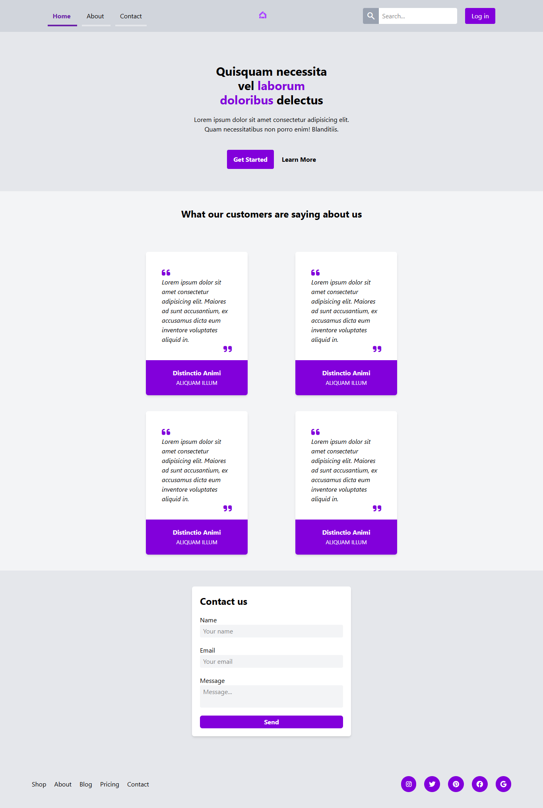

# :page_facing_up: TailwindCSS Review Page 

* Bu proje, Patika Frontend Bootcamp'i için oluşturulan **Hafta-4 / Ödev-2 / TailwindCSS Review Page** projesidir.
* **CSS:Tailwind** alıştırması için bir pratik projesidir.
* **HTML**,**CSS**,**Tailwind** kullanılmıştır.
*   Patika tarafından verilen Review Page template tasarımı Tailwind kullanılarak klonlandı.
---

## :computer: Kullanım

1.  Hafta-4 projelerimin olduğu toplu repomu klonlayın.
*   git clone https://github.com/tunahanyasar/Hafta-4.git
2. Odev-2 proje dosyasını seçerek çalıştırın.

---

## 📜 Sayfa Yapısı

:open_file_folder: **Klasörler;**
* *index.html*
* *tailwind.config.js*
* *img-page*

1. ***index.html***: Websitesi açıldığında Anasayfa karşılamaktadır. **one-page website** olarak tasarlanmıştır. 
    1.  Anasayfada **header** ve **header**in içinde **nav** bulunur. **nav** ile home, about, contact  alanlarına sayfa içinde yönlendirmeler yapılabilir. 
    2.  Ana içerik **Main** den oluşmakta ve içinde 3 adet **Section** bulunmakta;
        1. İlk **Section** hero kısmı. 
        2. İkinci **Section** about kısmı, 4 adet card bulunuyor.
        3. Üçüncü  **Section** Contact için form bulunuyor.
    3. **Footer**
3.  ***tailwin.config.js:*** index.html için yazılan TailwindCSS özelliklerinin TailwindCSS IntelliSense eklentisinin kullanımı için oluşturulmuştur.
4. ***img-page:*** Sayfanın ekran görüntüsünün bulunduğu klasör 

---

## 💡 Kullanılan Yapılar | Kazanımlar

**HTML:**
* Semantic Tags

**CSS:Tailwind**
*  Flex
*  Flex Alignment
*  Hover

    *  Fav-icon
    *  Google Material Symbols

---

## :paperclip: Sayfa Çıktıları
### Full Page

